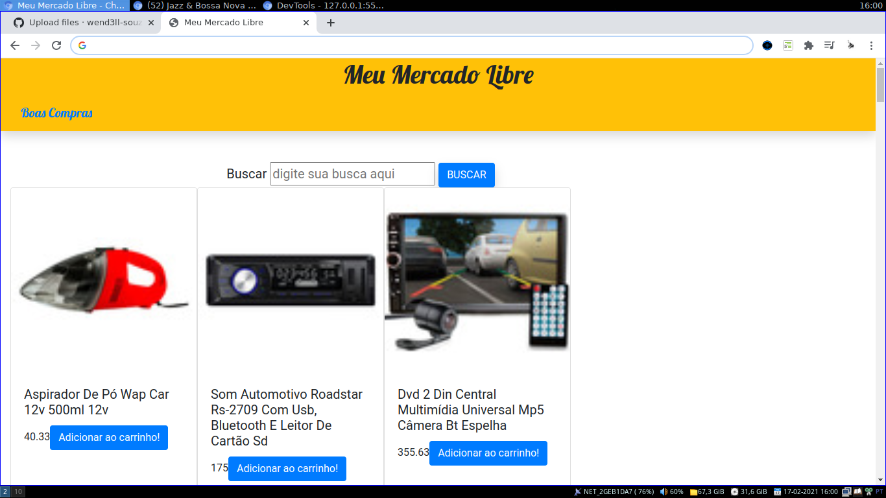

<h1 align="center">Meu Mercado Libre</h1>

Divertido projeto feito para praticar a conecção com API de banco de dados externa com Java Script.  Neste e-commerce irá ser usada a API disponililizada pelo mercado livre 

<h3 align="center">Bibliotecas Utilizadas</h3>

<h3 align="center"> Aplicação em Funcionamento </h3>
 

 
 

